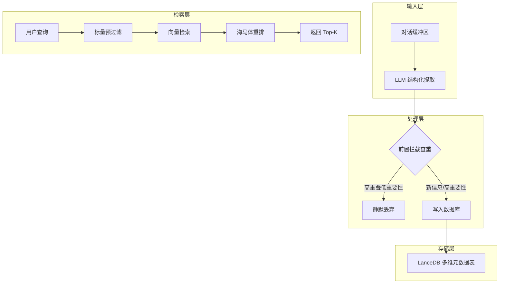

# Pico-Mem-Rust 进阶记忆系统实施计划

## 一、现状分析

### 1.1 当前代码结构

| 文件 | 功能 | 现状 |
|------|------|------|
| [`src/main.rs`](src/main.rs) | 主程序入口、RPC hook 处理 | 基础框架完整，支持 `hook.hello`、`hook.event`、`hook.before_llm`、`hook.after_llm` |
| [`src/memory.rs`](src/memory.rs) | 记忆管理器 | 简单的缓冲区管理、向量存储、基础检索 |
| [`src/api.rs`](src/api.rs) | API 客户端 | 仅支持纯文本摘要，无 JSON 模式 |
| [`src/config.rs`](src/config.rs) | 配置管理 | 基础配置结构，无 Schema 模板支持 |

### 1.2 当前数据模型（LanceDB Schema）

```rust
// 现有字段
{
    id: String,           // UUID
    text: String,         // 摘要文本
    role: String,         // "system_summary"
    timestamp: String,    // 时间戳
    vector: Vec<f32>      // 向量
}
```

### 1.3 核心差距

1. **API 层**：无 `response_format: { "type": "json_object" }` 强制 JSON 输出
2. **Schema 层**：缺少 `domain`、`memory_type`、`importance`、`status` 等元数据字段
3. **检索层**：仅支持纯向量检索，无标量预过滤和自定义重排
4. **写入层**：无查重拦截机制，容易产生记忆膨胀

---

## 二、目标架构

根据 [`ref/hybrid.md`](ref/hybrid.md) 的设计，目标架构包含四大核心模块：



---

## 三、分阶段实施计划

### 阶段一：底座重构 - 强制 JSON 结构化输出

**目标**：让 LLM 输出强类型的 JSON 结构，而非自由文本。

#### 1.1 新建 `src/schema.rs`

```rust
use serde::{Deserialize, Serialize};

#[derive(Serialize, Deserialize, Debug, Clone)]
pub struct MemoryExtraction {
    pub summary: String,
    pub domain: String,
    pub memory_type: MemoryType,
    pub importance: u8,        // 1-10
    pub status: Option<TaskStatus>,
}

#[derive(Serialize, Deserialize, Debug, Clone)]
#[serde(rename_all = "snake_case")]
pub enum MemoryType {
    Preference,
    Fact,
    Task,
}

#[derive(Serialize, Deserialize, Debug, Clone)]
#[serde(rename_all = "snake_case")]
pub enum TaskStatus {
    InProgress,
    Done,
}

impl MemoryExtraction {
    pub fn schema_description() -> String {
        serde_json::to_string_pretty(&serde_json::json!({
            "summary": "核心事实或摘要字符串",
            "domain": "所属领域标签，如 frontend_dev, backend_dev, daily_life",
            "memory_type": "枚举: preference, fact, task",
            "importance": "1到10的整数，表示重要性",
            "status": "如果是任务，填写 in_progress 或 done，否则为 null"
        })).unwrap()
    }
}
```

#### 1.2 修改 `src/api.rs`

- 在 `ChatRequest` 结构体中添加 `response_format` 字段
- 新增 `summarize_with_schema` 方法，返回 `MemoryExtraction` 结构体
- 在请求体中强制开启 JSON 模式

```rust
#[derive(Serialize)]
struct ChatRequest {
    model: String,
    messages: Vec<ChatMessage>,
    temperature: f32,
    max_tokens: u32,
    response_format: ResponseFormat,  // 新增
}

#[derive(Serialize)]
struct ResponseFormat {
    #[serde(rename = "type")]
    format_type: String,  // "json_object"
}
```

#### 1.3 修改 `config.yaml.exp`

- 将 `summarize_prompt` 改为模板形式，包含 `{SCHEMA_PLACEHOLDER}` 和 `{CHAT_HISTORY}` 占位符

```yaml
llm:
  summarize_prompt: >
    你是一个高阶的 Agent 记忆提取器。请分析以下对话，提取出用户的偏好、事实或当前的任务状态。
    绝对不要输出任何无关的解释，你的输出必须严格遵守以下 JSON 格式：
    {SCHEMA_PLACEHOLDER}
    
    对话内容：
    {CHAT_HISTORY}
```

---

### 阶段二：数据模型 - 多维元数据矩阵 Schema

**目标**：扩展 LanceDB 表结构，支持丰富的元数据维度。

#### 2.1 新增 Schema 字段

| 字段 | 类型 | 说明 |
|------|------|------|
| `id` | String | UUID 主键 |
| `summary` | String | 记忆摘要（被向量化） |
| `domain` | String | 所属领域 |
| `memory_type` | String | preference/fact/task |
| `importance` | u8 | 重要性评分 1-10 |
| `status` | Option<String> | 任务状态 |
| `access_count` | u32 | 访问频次（用于突触强化） |
| `timestamp` | String | 创建时间 |
| `vector` | Vec<f32> | 向量 |

#### 2.2 修改 `src/memory.rs` 的 `store_summary` 方法

- 重命名为 `store_memory`，接收 `MemoryExtraction` 结构体
- 构建包含所有元数据字段的 `RecordBatch`

#### 2.3 数据库迁移策略

- 检测旧表结构，自动迁移或重建

---

### 阶段三：写入策略 - 前置拦截防膨胀

**目标**：在写入数据库前进行查重，防止低价值重复记忆膨胀。

#### 3.1 核心拦截逻辑

```rust
pub async fn store_new_memory(
    &self,
    new_memory: MemoryExtraction,
    new_vec: Vec<f32>
) -> Result<StoreResult> {
    // 1. 查重：找最相似的 1 条
    let top_match = self.table
        .query()
        .nearest_to(new_vec.as_slice())?
        .limit(1)
        .execute()
        .await?;

    if let Some(old_record) = top_match.first() {
        let similarity = 1.0 - old_record.get_distance();
        let old_importance = old_record.get_importance();
        
        // 2. 拦截判定
        if similarity > 0.85 && new_memory.importance <= old_importance {
            return Ok(StoreResult::Rejected {
                reason: "高重叠且低重要性",
                similarity,
            });
        }
    }

    // 3. 正常写入
    self.table.add(vec![create_record(new_memory, new_vec)]).await?;
    Ok(StoreResult::Stored)
}
```

#### 3.2 新增配置项

```yaml
memory:
  overlap_threshold: 0.85    # 重叠度阈值
  enable_dedup: true         # 是否启用查重
```

---

### 阶段四：检索策略 - 混合检索与海马体打分

**目标**：实现标量预过滤 + 向量检索 + 自定义重排的混合检索。

#### 4.1 标量预过滤（Hybrid Search）

```rust
pub async fn search_by_domain(
    &self,
    query: &str,
    domain: &str,
    memory_types: &[&str],
) -> Result<Vec<MemoryRecord>> {
    let query_vector = self.api_client.get_embedding(query).await?;
    
    let filter = format!(
        "domain = '{}' AND memory_type IN ({})",
        domain,
        memory_types.iter().map(|t| format!("'{}'", t)).join(",")
    );
    
    let results = self.table
        .query()
        .filter(&filter)?
        .nearest_to(query_vector.as_slice())?
        .limit(10)
        .execute()
        .await?;
    
    // ...
}
```

#### 4.2 海马体打分（Reranking）

```rust
pub async fn search_with_rerank(
    &self,
    query: &str,
    similarity_weight: f32,  // 默认 0.6
    importance_weight: f32,  // 默认 0.4
) -> Result<Vec<MemoryRecord>> {
    let candidates = self.search_candidates(query, 20).await?;
    
    let mut ranked: Vec<_> = candidates
        .into_iter()
        .map(|record| {
            let score = (record.similarity * similarity_weight)
                      + ((record.importance as f32 / 10.0) * importance_weight);
            (score, record)
        })
        .collect();
    
    ranked.sort_by(|a, b| b.0.partial_cmp(&a.0).unwrap());
    Ok(ranked.into_iter().take(5).map(|(_, r)| r).collect())
}
```

#### 4.3 任务轮询（Task Polling）

```rust
pub async fn check_pending_tasks(&self) -> Result<Vec<MemoryRecord>> {
    let results = self.table
        .query()
        .filter("memory_type = 'task' AND status = 'in_progress'")?
        .limit(5)
        .execute()
        .await?;
    // ...
}
```

---

## 四、文件变更清单

| 文件 | 操作 | 说明 |
|------|------|------|
| `src/schema.rs` | 新建 | 定义 `MemoryExtraction`、`MemoryType`、`TaskStatus` 等结构体 |
| `src/api.rs` | 修改 | 添加 JSON 模式支持、新增 `summarize_with_schema` 方法 |
| `src/memory.rs` | 重构 | 扩展 Schema、实现混合检索、前置拦截 |
| `src/config.rs` | 修改 | 添加新配置项、支持模板占位符 |
| `config.yaml.exp` | 修改 | 更新 prompt 模板、添加新配置项 |
| `src/main.rs` | 修改 | 集成新的记忆管理逻辑 |

---

## 五、依赖项

当前 `Cargo.toml` 已有的依赖应该足够，可能需要确认：

- `serde_json` - JSON 处理
- `lancedb` - 向量数据库
- `arrow` - 数据批处理

---

## 六、风险与注意事项

1. **向后兼容**：旧数据库需要迁移策略
2. **LLM JSON 输出稳定性**：不同模型对 JSON 模式的支持程度不同
3. **性能影响**：前置查重会增加一次向量查询，但 `limit(1)` 开销很小
4. **配置迁移**：需要更新现有 `config.yaml` 文件

---

## 七、建议实施顺序

1. **先做阶段一**：这是所有后续功能的基础
2. **再做阶段二**：扩展数据模型
3. **然后阶段三**：实现写入拦截
4. **最后阶段四**：完善检索策略

建议从 **定义 `src/schema.rs` 和修改 `config.yaml` 占位符** 开始。